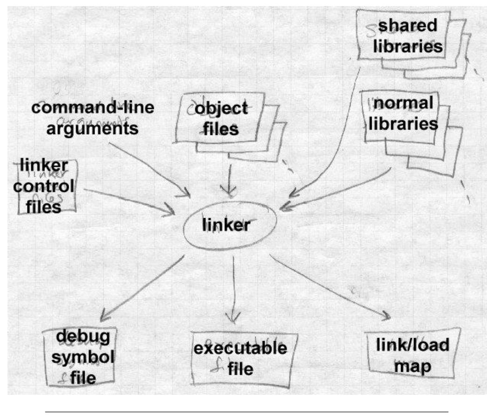
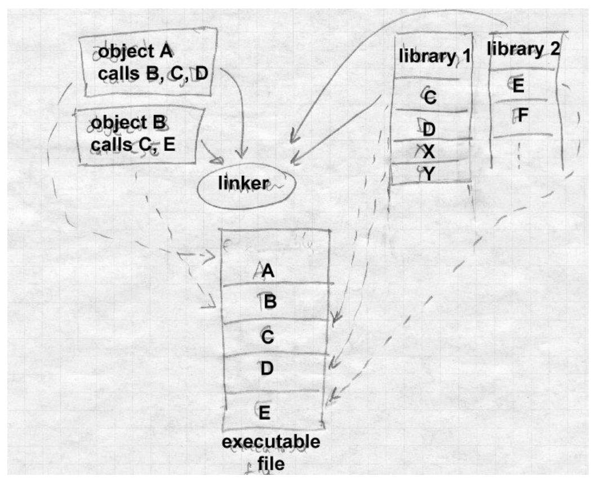

# Linking and Loading

## 1.What do linkers and loaders do?

The basic job of any linker or loader is simple: 

it binds more abstract  names to more concrete names, which permits programmers to write code using the more abstract names.

> The concept above is very important

That is, it takes a name written by a programmer such as `getline` and binds it to `the location 612 bytes from  the beginning of the executable code in module iosys`. Or it may take a more abstract numeric address such as `the location 450 bytes beyond the  beginning of the static data for this module` and bind it to a numeric address.

> we must know the two important term:
>
> executable module : don not contain any dummy info
>
> executable file : contain some context about file info,because the file within the disk must be recognized.

## 2.Address binding: a historical perspective

### 2.1 the way to undetstand linkers and loaders

A useful way to get some insight into what linkers and loaders do is to look at their part in the development of computer programming systems.

### 2.2 hand-translation period

The earliest computers were programmed entirely in machine language. Programmers would write out the symbolic programs on sheets of paper, hand assemble them into machine code and then toggle the machine code into the computer, or perhaps punch it on paper tape or cards. (Real hotshots could compose code directly at the switches.) 

If the programmer used symbolic addresses at all, the symbols were bound to addresses as the programmer did his or her hand translation. 

If it turned out that an instruction had to be added or deleted, the entire program had to be hand-inspected and any addresses affected by the added or deleted instruction adjusted. 

### 2.3 assembers-translation period

The problem was that the names were bound to addresses too early.

Assemblers solved that problem by letting programmers write programs in terms of symbolic names, with the assembler binding the names to machine addresses.

> now we don not need to foucs on how the high level code into the lower 

If the program changed, the programmer had to reassemble it, but the work of assigning the addresses is pushed off from the programmer to the computer.

### 2.4 address assignment in linking period (bare mechine)

Libraries of code compound the address assignment problem.

Since the basic operations that computers can perform are so simple, useful programs are composed of subprograms that perform higher level and more complex operations. computer installations keep a library of pre-written and debugged subprograms that programmers can draw upon to use in new programs they write, rather than requiring programmers to write all their own subprograms. 

The programmer then loads the subprograms in with the main program to form a complete working program. Programmers were using libraries of subprograms even before they used assemblers. 

By 1947, John Mauchly, who led the ENIAC project, wrote about loading programs along with subprograms selected from a catalog of programs stored on tapes, and of the need to relocate the subprograms’ code to reflect the addresses at which they were loaded. Perhaps surprisingly, these two basic linker functions, relocation and library search, appear to predate even assemblers, as Mauchly expected both the program and subprograms to be written in machine language. 

The relocating loader allowed the authors and users of the subprograms to write each subprogram as though it would start at location zero, and to defer the actual address binding until the subprograms were linked with a particular main program. 

### 2.4 address assignment in loading period (operating system)

With the advent of operating systems, relocating loaders separate from linkers and libraries became necessary. 

Before operating systems, each program had the machine’s entire memory at its disposal(bare mechine), so the program could be assembled and linked for fixed memory addresses(because everything the program can do), knowing that all addresses in the computer would be available.

But with operating systems, the program had to share the computer’s memory with the operating system and perhaps even with other programs(meanwhile the program can also denote process or thread or task), This means that the actual addresses at which the program would be running weren’t known until the operating system loaded the program into memory   pay attention to that now the executable file(not the executable  module) is stored on the secondary memory that also can described the disk or flash or type 

**Deferring final address binding past link time to load time.** 

Linkers and loaders now divided up the work, with linkers doing part of the address binding, assigning relative addresses within each program, and the loader doing a final relocation step to assign actual addresses

**The process of mapping a logical address to an actual physical address is relocation**

### 2.5 overlay technology comes up

As systems became more complex, they called upon linkers to do more and more complex name management and address binding. Fortran programs used multiple subprograms and common blocks, areas of data shared by multiple subprograms, and it was up to the linker to lay out storage and assign the addresses both for the subprograms and the common blocks. 

Linkers increasingly had to deal with object code libraries. including both application libraries written in Fortran and other languages, and compiler support libraries called implcitly from compiled code to handle I/O and other high-level operations.

Programs quickly became larger than available memory, so linkers provided overlays, a technique that let programmers arrange for different parts of a program to share the same memory, with each overlay loaded on demand when another part of the program called into it.

Overlays were widely used on mainframes from the advent of disks around 1960 until the spread of virtual memory in the mid-1970s, then reappeared on microcomputers in the early 1980s in exactly the same form, and faded as virtual memory appeared on PCs in the 1990s. They’re still used in memory limited embedded environments, and may yet reappear in other places where precise programmer or compiler control of memory usage improves performance.

### 2.6 section term comes up

With the advent of hardware relocation and virtual memory, linkers and loaders actually got less complex, since each program could again have an entire address space. Programs could be linked to be loaded at fixed addresses, with hardware rather than software relocation taking care of any load-time relocation.

But computers with hardware relocation invariably run more than one program, frequently multiple copies of the same program. 

When a computer runs multiple instances of one program, some parts of the program are the same among all running instance (the executable code, in particular), while other parts are unique to each instance. 

If the parts that don’t change can be separated out from the parts that do change, the operating system can use a single copy of the unchanging part, saving considerable storage. 

> The context above is the propose to sovle the saving considerable storage and the efficiency of the computer. And then the section concept comes up.

**Compilers and assemblers were modified to create object code in multiple sections**

with one section for read only code and another section for writable data, the linker had to be able to combine all of sections of each type so that the linked program would have all the code in one place and all of the data in another. 

> Attention : As we previous say,the executable module is different from the executable file.the executable file contains many contexts about section and dummy info.

### 2.7 Static libraries

This didn’t delay address binding any more than it already was, since addresses were still assigned at link time, but more work was deferred to the linker to assign addresses for all the sections. Even when different programs are running on a computer, those different programs usually turn out to share a lot of common code. For example, nearly every program written in C uses routines such as fopen and printf, database applications all use a large access library to connect to the database, and programs running under a GUI such as X Window, MS Windows, or the Macintosh all use pieces of the GUI library. Most systems now provide shared libraries for programs to use, so that all the programs that use a library can share a single copy of it. This both improves runtime performance and savesalot of disk space.

### 2.8 Dynamic libraries

in small programs the common library routines often take up more space than the program itself. In the simpler static shared libraries, each library is bound to specific addresses at the time the library is built, and the linker binds program references to library routines to those specific addresses at link time. Static libraries turn out to be inconveniently inflexible, since programs potentially have to be relinked every time any part of the library changes, and the details of creating static shared libraries turn out to be very tedious. 

Systems added dynamically linked libraries in which library sections and symbols aren’t bound to actual addresses until the program that uses the library starts running. Sometimes the binding is delayed even farther than that.

with full-fledged dynamic linking, the addresses of called procedures aren’t bound until the first call. Furthermore, programs can bind to libraries as the programs are running, loading libraries in the middle of program execution. 

This provides a powerful and high-performance way to extend the function of programs. Microsoft Windows in particular makes extensive use of runtime loading of shared libraries (known as DLLs, Dynamically Linked Libraries) to construct and extend programs.

## 3.Linking vs loading

Linkers and loaders perform several related but conceptually separate actions

### 3.1 Program loading

Copy a program from secondary storage (which since about 1968 invariably means a disk) into main memory so it’s ready to run. In some cases loading just involves copying the data from disk to memory, in others it involves allocating storage, setting protection bits, or arranging for virtual memory to map virtual addresses to disk pages.

### 3.2 Relocation

Compilers and assemblers generally create each file of object code with the program addresses starting at zero, but few computers let you load your program at location zero. If a program is created from multiple subprograms, all the subprograms have to be loaded at non-overlapping addresses. Relocation is the process of assigning load addresses to the various parts of the program, adjusting the code and data in the program to reflect the assigned addresses. 

In many systems, relocation happens more than once. It’s quite common for a linker to create a program from multiple subprograms, and create one linked output program that starts at zero, with the various subprograms relocated to locations within the big program. Then when the program is loaded, the system picks the actual load address and the linked program is relocated as a whole to the load address.

### 3.3 Symbol resolution

When a program is built from multiple subprograms, the references from one subprogram to another are made using symbols a main program might use a square root routine called `sqrt`, and the math library defines `sqrt`. 

A linker resolves the symbol by noting the location assigned to sqrt in the library, and patching the caller’s object code to so the call instruction refers to that location.

## 4.Two-pass linking

Now we turn to the general structure of linkers. Linking, like compiling or assembling, is fundamentally a two pass process. 

A linker takes as its input a set of input object files, libraries, and perhaps command files, and produces as its result an output object file, and perhaps ancillary information such as a load map or a file containing debugger symbols

Each input file contains a set of segments, contiguous chunks of code or data to be placed in the output file.

Each input file also contains at least one symbol table. Some symbols are exported, defined within the file for use in other files, generally the names of routines within the file that can be called from elsewhere. Other symbols are imported, used in the file but not defined, generally the names of routines called from but not present in the file.

### 4.1 first pass

When a linker runs, it first has to scan the input files to find the sizes of the segments and to collect the definitions and references of all of the symbols.

> I think what first linker do is collect all the input file symbols  .And every symbol has its own definitions place and references place

 It creates a segment table listing all of the segments defined in the input files, and a symbol table with all of the symbols imported or exported.

Using the data from the first pass, the linker assigns numeric locations to symbols, determines the sizes and location of the segments in the output address space, and figures out where everything goes in the output file

> Then the linker will assigns numeric locations addresses to symbols

### 4.2 second pass

The second pass uses the information collected in the first pass to control the actual linking process.

It reads and relocates the object code, substituting numeric addresses for symbol references, and adjusting memory addresses in code and data to reflect relocated segment addresses, and writes the relocated code to the output file. It then writes the output file, generally with header information, the relocated segments, and symbol table information. 

If the program uses dynamic linking, the symbol table contains the info the runtime linker will need to resolve dynamic symbols. In many cases, the linker itself will generate small amounts of code or data in the output file, such as "glue code" used to call routines in overlays or dynamically linked libraries, or an array of pointers to initialization routines that need to be called at program startup time.

## 5.Object code libraries

All linkers support object code libraries in one form or another, with most also providing support for various kinds of shared libraries. The basic principle of object code libraries is simple enough. A library is little more than a set of object code files. (Indeed, on some systems you can literally catenate a bunch of object files together and use the result as a link library.) After the linker processes all of the regular input files, if any imported names remain undefined, it runs through the library or libraries and links in any of the files in the library that export one or more undefined names.

Shared libraries complicate this task a little by moving some of the work from link time to load time.

> Because when in the linking time linker just notes the position of the reference 

The linker identifies the shared libraries that resolve the undefined names in a linker run, but rather than linking anything into the program, the linker notes in the output file the names of the libraries in which the symbols were found, so that the shared library can be bound in when the program is loaded. 

## 6.Relocation and code modification