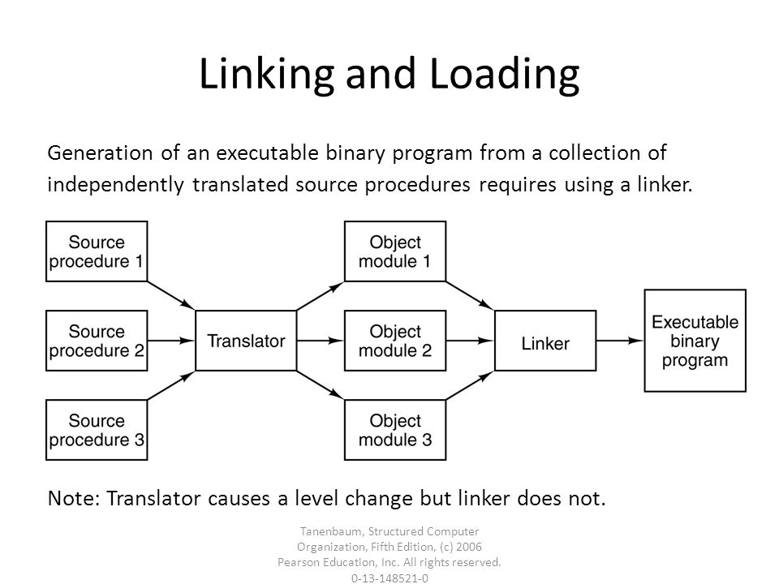

# **The process of translaing code**

|Attention:The Translator consists of three parts.1.precomplier 2.compiler3.assember

# Differences between Linking and Loading

1. The key difference between linking and loading is that the linking generates the executable file of a program whereas, the loading loads the executable file obtained from the linking into main memory for execution.
2. The linking intakes the object module of a program generated by the assembler. However, the loading intakes the executable module generated by the linking.
3. The linking combines all object modules of a program to generate executable modules it also links the library function in the object module to built-in libraries of the high-level programming language. On the other hand, loading allocates space to an executable module in main memory.

# **Distinction between Virtual and Real address**

**Virtual address:** It is also called as logical address. It is an address used by computer software programs as a reference point in virtual memory.

**Real address:** It is also called as absolute or direct or machine address. It is an address is a specific memory address location, instead of an expression.

# What is the overlay

In computer programming, “overlaying” is a programming method that allows programs to be larger than the computer main memory. Overlaying means here the process of transferring a block of code or other data into main memory and replacing what is already stored. This is normally used by embedded systems because of the limitations of physical memory.

# Virtual memory&Hardware relocation

Virtual memory is a memory management technique where secondary memory can be used as if it were a part of the main memory. Virtual memory is a common technique used in a computer's operating system (OS).