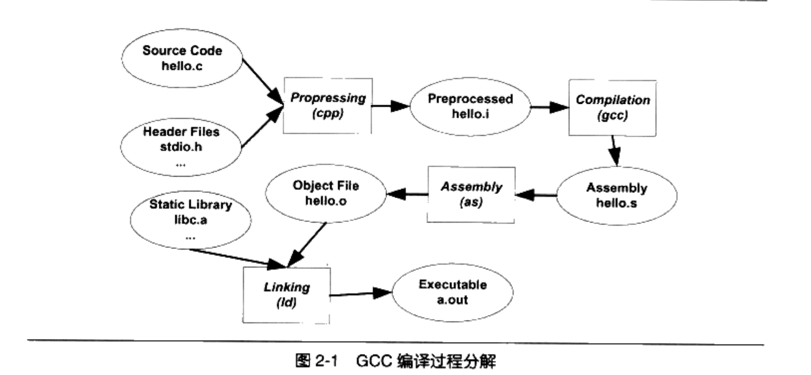

# **The process of translaing code**




|<font color='red'>Attention:The Translator consists of three parts.1.precomplier 2.compiler3.assember</font>

# Differences between Linking and Loading

1. The key difference between linking and loading is that the linking generates the executable file of a program whereas, the loading loads the executable file obtained from the linking into main memory for execution.
2. The linking intakes the object module of a program generated by the assembler. However, the loading intakes the executable module generated by the linking.
3. The linking combines all object modules of a program to generate executable modules it also links the library function in the object module to built-in libraries of the high-level programming language. On the other hand, loading allocates space to an executable module in main memory.

# **Distinction between Virtual and Real address**

**Virtual address:** It is also called as logical address. It is an address used by computer software programs as a reference point in virtual memory.

**Real address:** It is also called as absolute or direct or machine address. It is an address is a specific memory address location, instead of an expression.

# What is the overlay

In computer programming, <font color='red'>“overlaying” is a programming method that allows programs to be larger than the computer main memory</font>. Overlaying means here the process of transferring a block of code or other data into main memory and replacing what is already stored. This is normally used by embedded systems because of the limitations of physical memory.

# Virtual memory&Hardware relocation

Virtual memory is a <font color='cornflowerblue'>memory management technique</font> where secondary memory can be used as if it were a part of the main memory. Virtual memory is a common technique used in a computer's operating system (OS).


# what is build

Build consist of two part.one is compile ,another is link

Compilation and linking are often referred to as build

# what can compiler do

## why we need the compiler

<font color='red'>从最直观的角度来讲，编译器就是将高级语言翻译成机器语言的一个工具。</font>

比如我们用C/C++语言写的一个程序可以使用编译器将其翻译成机器可以执行的指令及数据。我们前面也提到了，使用机器指令或汇编语言编写程序是十分费事及乏味的事情，它们使得程序开发的效率十分低下。

<font color='cornflowerblue'>并且使用机器语言或汇编语言编写的程序依赖于特定的机器</font>，一个为某种CPU编写的程序在另外一种CPU下完全无法运行，需要重新编写，这几乎是令人无法接受的。所以人们期望能够采用类似于自然语言的语言来描述一个程序，但是自然语言的形式不够精确，所以类似于数学定义的编程语言很快就诞生了。20世纪的六七十年代诞生了很多高级语言，有些至今仍然非常流行，如FORTRAN、C语言等（准确地讲，FORTRAN诞生于20世纪50年代的IBM)。高级语言使得程序员们能够更加关注程序逻辑的本身，而尽量少考虑计算机本身的限制，如字长、内存大小、通信方式、存储方式等。高级编程语言的出现使得程序开发的效率大大提高,高级语言的可移植性也使得它在多种计算机平台下能够游刃有余。据研究，高级语言的开发效率是汇编语言和机器语言的5倍以上。

## compile step


### example code

```c
array[index] = (index + 4) *(2 + 6);
```

### 1.scanner

首先源代码程序被输入到扫描器（Scanner)，扫描器的任务很简单，它只是简单地进行词法分析，运用一种类似于有限状态机(Finite State Machine〉的算法可以很轻松地将源代码的字符序列分割成一系列的记号(Token)。比如上面的那行程序，总共包含了28个非空字符，经过扫描以后，产生了16个记号，如表2-1所示。


词法分析产生的记号一般可以分为如下几类:<font color='cornflowerblue'>关键字、标识符、字面量（包含数字、字符串等）和特殊符号（如加号、等号)。</font><font color='cornflowerblue'>在识别记号的同时，扫描器也完成了其他工作。比如将标识符存放到符号表，将数字、字符串常量存放到文字表等，以备后面的步骤使用。</font>

有一个叫做lex 的程序可以实现词法扫描，它会按照用户之前描述好的词法规则将输入的字符串分割成一个个记号。

因为这样个程序的存在，编译器的开发者就无须为每个编译器开发一个独立的词法扫描器，而是根据需要改变词法规则就可以了。
另外对于一些有预处理的语言，比如C语言，它的宏替换和文件包含等工.作一般不归入编译器的范围而交给一个独立的预处理器。

### 2.grammar parser

接下来语法分析器（Grammar Parser）将对由扫描器产生的记号进行语法分析，从而产生语法树(Syntax Tree)

。整个分析过程采用了上下文无关语法(Context-free Grammar)的分析手段，如果你对上下文无关语法及下推自动机很熟悉，那么应该很好理解。否则，可以参考一些计算理论的资料，一般都会有很详细的介绍。此处不再赘述。

<font color='red'>简单地讲，由语法分析器生成的语法树就是以表达式（Expression）为节点的树。</font>我们知道，C语言的一个语句是一个表达式，而复杂的语句是很多表达式的组合。上面例子中的语句就是一个由赋值表达式、加法表达式、乘法表达式、数组表达式、括号表达式组成的复杂语句。它在经过语法分析器以后形成如图2-3所示的语法树。


从图2-3中我们可以看到，整个语句被看作是一个赋值表达式;赋值表达式的左边是-一
个数组表达式，它的右边是一个乘法表达式;数组表达式又由两个符号表达式组成。所以它们通常作为整个语符号和数字是最小的表达式，它们不是由其他的表达式来组成的，所以它们通常作为整个语法树的叶节点。

在语法分析的同时，很多运算符号的优先级和含义也被确定下来了。比如乘
法表达式的优先级比加法高，而圆括亏衣也可以表示对指针取内容的表达式，多重含义，比如星号*在C语言中可以表示乘法表达式，也可以表示对指针取内容的表达式,
所以语法分析阶段必须对这些内容进行区分。

如果出现了表达式不合法，比如各种括号不匹配、表达式中缺少操作符等，编译器就会报告语法分析阶段的错误。

正如前面词法分析有lex 一样，语法分析也有一个现成的.T.具叫做yacc ( Yet AnotherCompiler Compiler)。它也像lex--样，可以根据用户给定的语法规则对输入的记号序列进行解析，从而构建出一棵语法树。对于不同的编程语言，编译器的开发者只须改变语法规则,而无须为每个编译器编写一个语法分析器，所以它又被称为“编译器编译器(CompilerCompiler)”。

### 3.semantic analyzer

接下来进行的是语义分析，由语义分析器(Semantic Analyzer）来完成。语法分析仅仪是完成了对表达式的语法层面的分析，但是它并不了解这个语句是否真正有意义。比如C语言里面两个指针做乘法运算是没有意义的，但是这个语句在语法上是合法的;比如同样一个指针和一个浮点数做乘法运算是否合法等。编译器所能分析的语义是静态语(StaticSemantic)，所谓静态语义是指在编译期可以确定的语义，与之对应的动态语义(Dynamic Semantic）就是只有在运行期才能确定的语义。

<font color='orange'>静态语义</font>通常包括声明和类型的匹配，类型的转换。比如当一个浮点型的表达式赋值给一个整型的表达式时，其中隐含了一个浮点型到整型转换的过程，语义分析过程中需要完成这个步骤。比如将一个浮点型赋值给一个指针的时候,语义分析程序会发现这个类型不匹配,编译器将会报错。

<font color='orange'>动态语义</font>一般指在运行期出现的语义相关的问题，比如将0作为除数是一个运行期语义错误。

经过语义分析阶段以后，整个语法树的表达式都被标识了类型，如果有些类型需要做隐式转换，语义分析程序会在语法树中插入相应的转换节点。上面描述的语法树在经过语义分析阶段以后成为如图2-4所示的形式。


可以看到，每个表达式(包括符号和数字）都被标识了类型。我们的例子中几乎所有的表达式都是整型的，所以无须做转换，整个分析过程很顺利。语义分析器还对符号表里的符号类型也做了更新。

### 4.source code optimizer

现代的编译器有着很多层次的优化，往往在源代码级别会有一个优化过程。我们这里所描述的源码级优化器(Source Code Optimizer〉在不同编译器中可能会有不同的定义或有一些其他的差异。源代码级优化器会在源代码级别进行优化，在上例中，细心的读者可能已经发现，(2＋6）这个表达式可以被优化掉，因为它的值在编译期就可以被确定。类似的还有很多其他复杂的优化过程，我们在这里就不详细描述了。经过优化的语法树如图2-5所示。


我们看到(2+6）这个表达式被优化成8。其实直接在语法树上作优化比较困难，所以源代码优化器往往将整个语法树转换成<font color='cornflowerblue'>中间代码(Intermediate Code)</font>，它是语法树的顺序表示，其实它已经非常接近目标代码了。但是它一般跟目标机器和运行时环境是无关的，比如它不包含数据的尺寸、变量地址和寄存器的名字等。

中间代码有很多种类型，在不同的编译器中有着不同的形式，比较常见的有:三地址码（Three-address Code）和P-代码(P-Code)。

我们就拿最常见的三地址码来作为例子，最基本的三地址码是这样的:x = y op z
这个三地址码表示将变量y和z进行op操作以后，赋值给x。这里op操作可以是算数运算，比如加减乘除等，也可以是其他任何可以应用到y和z的操作。三地址码也得名于此,因为-一个三地址码语句里面有三个变量地址。我们上面的例子中的语法树可以被翻译成三地址码后是这样的:

t1 = 2 + 6

t2 = index +4

t3 = t2 * t1

array [ index] =t 3

我们可以看到，为了使所有的操作都符合三地址码形式，这里利用了几个临时变量: t1、t和 t3。在三地址码的基础上进行优化时，优化程序会将2+6的结果计算出来，得到tl =6.然后将后面代码中的t1替换成数字6。还可以省去一个临时变量t3，因为t2可以重复利用。经过优化以后的代码如下:

t2 = index + 4

t2 = t2 * 8

array [index] = t2

<font color='red'>中间代码使得编译器可以被分为前端和后端。编译器前端负责产生机器无关的中间代码，编译器后端将中间代码转换成目标机器代码。这样对于一些可以跨平台的编译器而言,它们可以针对不同的平台使用同一个前端和针对不同机器平台的数个后端。</font>

### 5.code generator

<font color='cornflowerblue'>源代码级优化器产生中间代码标志着下面的过程都属于编辑器后端</font>。

<font color='red'>编译器后端主要包括代码生成器（Code Generator）和目标代码优化器(Target Code Optimizer)。</font>

让我们先来看看代码生成器。代码生成器将中间代码转换成目标机器代码，这个过程十分依赖于目标机器，因为不同的机器有着不同的字长、寄存器、整数数据类型和浮点数数据类型等。对于上面例子中的中间代码，代码生成器可能会生成下面的代码序列(我们用x86的汇编语言来表示，并且假设index的类型为 int型，array的类型为 int型数组):


### 6.target code optimizer

最后目标代码优化器对上述的目标代码进行优化，比如选择合适的寻址方式、使用位移来代替乘法运算、删除多余的指令等。上面的例子中，乘法由一条相对复杂的基址比例变址寻址（Base Index Scale Addressing)的lea指令完成，随后由一条mov指令完成最后的赋值操作，这条mov指令的寻址方式与lea是一样的。


### Summary

现代的编译器有着异常复杂的结构，这是因为现代高级编程语言本身非常地复杂，比如C++语言的定义就极为复杂，至今没有一个编译器能够完整支持C++语言标准所规定的所有语言特性。另外现代的计算机CPU相当地复杂，CPU本身采用了诸如流水线、多发射、超标量等诸多复杂的特性，为了支持这些特性，编译器的机器指令优化过程也变得十分复杂。使得编译过程更为复杂的是有些编译器支持多种硬件平台，即允许编译器编译出多种目标CPU的代码。比如著名的GCC编译器就几乎支持所有CPU 平台，这也导致了编译器的指令生成过程更为复杂。

<font color='red'>经过这些扫描、语法分析、语义分析、源代码优化、代码生成和目标代码优化，编译器忙活了这么多个步骤以后，源代码终于被编译成了目标代码。</font>

但是这个目标代码中有一个问题是: <font color='cornflowerblue'>index和array 的地址还没有确定。</font>如果我们要把目标代码使用汇编器编译成真正能够在机器上执行的指令，那么index和 array 的地址应该从哪儿得到呢?如果index和定义在跟上面的源代码同一个编译单元里面，那么编译器可以为index和 array分配空间，确定它们的地址;那如果是定义在其他的程序模块呢?

这个看似简单的问题引出了我们一个很大的话题:目标代码中有变量定义在其他模块，该怎么办﹖事实上<font color='red'>，定义其他模块的全局变量和函数在最终运行时的绝对地址都要在最终链接的时候才能确定。</font>所以现代的编译器可以将一个源代码文件编译成一个未链接的目标文件，然后由链接器最终将这些目标文件链接起来形成可执行文件。让我们带着这个问题，走进链接的世界。

# what can linker do

## 1.history

为了更好地理解计算机程序的编译和链接的过程,我们简单地回顾计算机程序开发的历史一定会非常有益。计算机的程序开发并非从一开始就有着这么复杂的自动化编译、链接过程。<font color='cornflowerblue'>原始的链接概念远在高级程序语言发明之前就已经存在了</font>﹐在最开始的时候，程序员(当时程序员的概念应该跟现在相差很大了)先把一个程序在纸上写好，当然当时没有很高级的语言，用的都是机器语言，甚至连汇编语言都没有。当程序须要被运行时，程序员人工将他写的程序写入到存储设备上，最原始的存储设备之一就是纸带，即在纸带上打相应的孔。

这个过程我们可以通过图2-6来看到，假设有一种计算机，它的每条指令是1个字节，也就是8位。我们假设有一种跳转指令，<font color='red'>它的高4位是0001，表示这是一条跳转指令:低4</font>


<font color='red'>位存放的是跳转目的地的绝对地址。</font>我们可以从图2-6中看到，这个程序的第一条指令就是一条跳转指令，它的目的地址是第5条指令（注意，第5条指令的绝对地址是4)。

至于0和Ⅰ怎么映射到纸带上，这个应该很容易理解，比如我们可以规定纸带上每行有8个孔位，每个孔位代表一位，穿孔表示0，未穿孔表示1。

现在问题来了，程序并不是一写好就永远不变化的，它可能会经常被修改。比如我们在第1条指令之后、第5条指令之前插入了一条或多条指令，<font color='red'>那么第5条指令及后面的指令的位置将会相应地往后移动，原先第一条指令的低4位的数字将需要相应地调整。</font>在这个过程中，程序员需要人为重新计算每个子程序或跳转的目标地址。当程序修改的时候，这些位置都要重新计算，十分繁琐又耗时，并且很容易出错。

<font color='red'>这种重新计算各个目标的地址过程被叫做重定位（ Relocation)。</font>

如果我们有多条纸带的程序，这些程序之间可能会有类似的跨纸带之间的跳转，这种程序经常修改导致跳转目标地址变化在程序拥有多个模块的时候更为严重。人工绑定进行指令的修正以确保所有的跳转目标地址都正确，在程序规模越来越大以后变得越来越复杂和繁琐。
没办法，这种黑暗的程序员生活是没有办法容忍的。

先驱者发明了汇.编语言，这相比机器语言来说是个很大的进步。汇编语言使用接近人类的各种符号和标记来帮助记忆，比如指令采用两个或三个字母的缩写，记住“jmp”比记住0001XXXX是跳转（jump〉指令容易得多了:汇编语言还可以使用符号来标记位置，比如一个符号“divide”表示一个除法子程序的起始地址，比记住从某个位置开始的第几条指令是除法子程序方便得多。最重要的是，这种符号的方法使得人们从具体的指令地址中逐步解放出来。比如前面纸带程序中，我们把刚开始第5条指令开始的子程序命名为“foo”，那么第一条指令的汇编就是:

```asm
jmp foo
```

当然人们可以使用这种符号命名子程序或跳转目标以后，不管这个“foo”之前插入或减少了多少条指令导致“foo”目标地址发生了什么变化（出现了整体的概念，块的概念），汇编器在每次汇编程序的时候会重新计算“foo”这个符号的地址，然后把所有引用到“foo”的指令修正到这个正确的地址（code modification）。整个过程不需要人工参与，对于一个有成百上千个类似的符号的程序，程序员终于摆脱了这种低级的繁琐的调整地址的工作，用一句政治口号来说叫做“极大地解放了生产力”。

## 2.symbol arise

<font color='red'>符号(Symbol）这个概念随着汇编语言的普及迅速被使用，它用来表示一个地址，这个地址可能是一段子程序（后来发展成函数〉的起始地址，也可以是一个变量的起始地址。</font>

有了汇编语言以后，生产力大大提高了，随之而来的是软件的规模也开始日渐庞大。这时程序的代码量也已经开始快速地膨胀,导致人们要开始考虑将不同功能的代码以一定的方式组织起来，使得更加容易阅读和理解，以便于日后修改和重复使用。自然而然，人们开始将代码按照功能或性质划分，分别形成不同的功能模块，不同的模块之间按照层次结构或其他结构来组织。这个在现代的软件源代码组织中很常见，比如在C语言中，最小的单位是变量和函数，若干个变量和函数组成一个模块，存放在一个“.c”的源代码文件里，然后这些源代码文件按照目录结构来组织。在比较高级的语言中，如Java中，每个类是一个基本的模块，若干个类模块组成一个包( Package)，若干个包组合成一个程序。
在现代软件开发过程中，软件的规模往往都很大，动辄数百万行代码，如果都放在一个模块肯定无法想象。所以现代的大型软件往往拥有成千上万个模块，这些模块之间相互依赖又相对独立。这种按照层次化及模块化存储和组织源代码有很多好处,比如代码更容易阅读、理解、重用，每个模块可以单独开发、编译、测试，改变部分代码不需要编译整个程序等。

## 3.how to build a program

<font color='red'>在一个程序被分割成多个模块以后,这些模块之间最后如何组合形成一个单一的程序是须解决的问题。</font>

模块之间如何组合的问题可以归结为模块之间如何通信的问题，最常见的属于静态语言的C++模块之间通信有两种方式

<font color='cornflowerblue'>一种是模块间的函数调用，另外一种是模块间的变量访问。</font>

<font color='red'>函数访问须知道目标函数的地址，变量访问也须知道目标变量的地址，所以这两种方式都可以归结为一种方式，那就是模块间符号的引用。</font>

模块间依靠符号来通信类似于拼图版，定义符号的模块多出一块区域，引用该符号的模块刚好少了那一块区域，两者一拼接刚好完美组合(见图2-7)。这个模块的拼接过程就是本书的一个主题:链接（Linking)。


# static linking

## 1.Flow

程序设计的模块化是人们一直在追求的目标，因为当一个系统十分复杂的时候，我们不得不将一个复杂的系统逐步分割成小的系统以达到各个突破的目的。一个复杂的软件也如此，人们把每个源代码模块独立地编译，然后按照须要将它们“组装”起来，这个组装模块的过程就是链接(Linking)。

<font color='red'>链接的主要内容就是把各个模块之间相互引用的部分都处理好，使得各个模块之间能够正确地衔接。</font>

链接器所要做的工作其实跟前面所描述的“程序员人工调整地址”本质上没什么两样，只不过现代的高级语言的诸多特性和功能，使得编译器、链接器更为复杂，功能更为强大，但从原理上来讲，它的工作无非就是把一些指令对其他符号地址的引用加以修正。

<font color='red'>链接过程主要包括了地址和空间分配（Address and StorageAllocation)、符号决议(Symbol Resolution）和重定位（Relocation）等这些步骤。</font>


## 2.runtime library

<font color='cornflowerblue'>最常见的库就是运行时库（Runtime Library)，它是支持程序运行的基本函数的集合。</font><font color='cornflowerblue'>库其实是一组目标文件的包，就是一些最常用的代码编译成目标文件后打包存放。</font>

## 3.example

现代的编译和链接过程也并非想象中的那么复杂，它还是一个比较容易理解的概念。

比如我们在程序模块main.c中使用另外一个模块func.c中的函数 foo()。我们在main.c模块中每一处调用foo 的时候都必须确切知道foo这个函数的地址，但是由于每个模块都是单独编译的，在编译器编译main.c的时候它并不知道foo函数的地址，所以它暂时把这些调用foo的指令的目标地址搁置，等待最后链接的时候由链接器去将这些指令的目标地址修正。如果没有链接器，须要我们手工把每个调用foo 的指令进行修正，则填入正确的foo函数地址。当func.c模块被重新编译，foo函数的地址有可能改变时，那么我们在main.c中所有使用到foo的地址的指令将要全部重新调整。这些繁琐的工作将成为程序员的噩梦。使用链接器，

<font color='cornflowerblue'>你可以直接引用其他模块的函数和全局变量而无须知道它们的地址,因为链接器在链接的时候，会根据你所引用的符号 foo，自动去相应的func.c模块查找foo的地址，然后将main.c模块中所有引用到foo的指令重新修正，让它们的目标地址为真正的foo函数的地址。</font>


在链接过程中，对其他定义在目标文件中的函数调用的指令须要被重新调整，对使用其他定义在其他目标文件的变量来说，也存在同样的问题。让我们结合具体的CPU指令来了解这个过程。

假设我们有个全局变量叫做var，它在目标文件A里面。我们在目标文件B里面要访问这个全局变量，比如我们在目标文件B里面有这么一条指令:

```asm
movl $0x2a,var
```

这条指令就是给这个var变量赋值0x2a，相当于C语言里面的语句 var = 42。然后我们编译目标文件B．得到这条指令机器码，如图2-9所示。


<font color='red'>由于在编译目标文件B的时候，编译器并不知道变量var的目标地址，所以编译器在没法确定地址的情况下，将这条mov指令的目标地址置为0，等待链接器在将目标文件A和B链接起来的时候再将其修正。</font>

我们假设A和B链接后，变量var的地址确定下来为0x1000,那么链接器将会把这个指令的目标地址部分修改成0x1000。这个地址修正的过程也被叫做重定位（Relocation)(code modification)，每个要被修正的地方叫一个重定位入口(Relocation Entry)。重定位所做的就是给程序中每个这样的绝对地址引用的位置“打补丁”，使它们指向正确的地址。