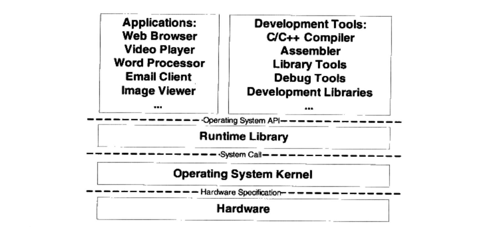
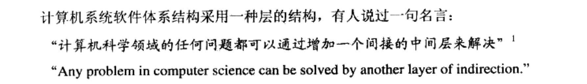

## 1.target file type

The type of target file depends on the operating system（or bare hardware）、hardware architecture, and compiler。

# 2.layer 

When designing an embedded system, the idea of hierarchical design should be followed

