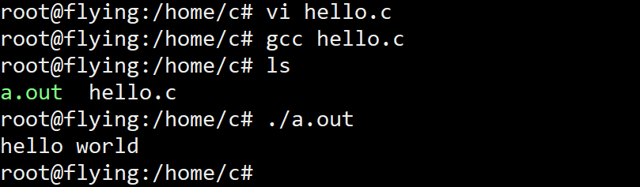
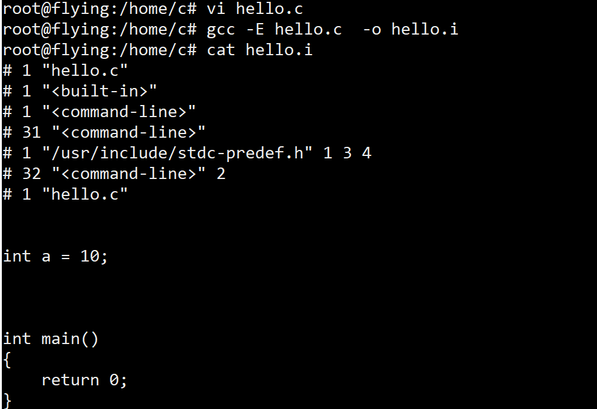
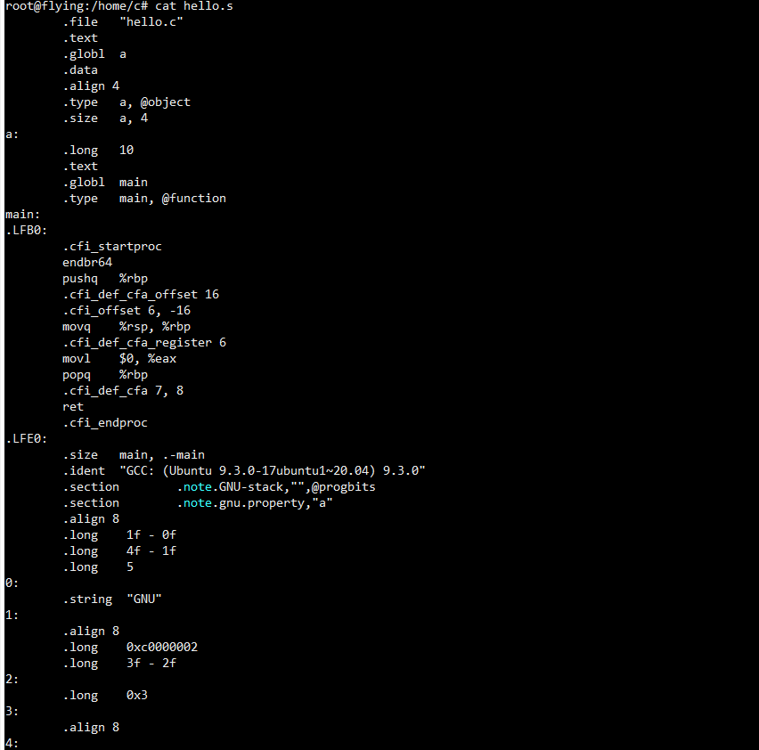
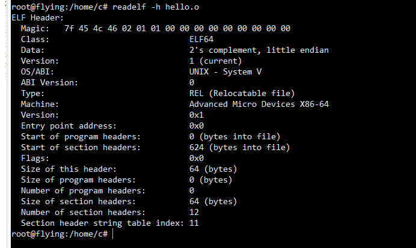

# 1.Hello World

## source code

```c
#include "stdio.h"
int main()
{
    printf("hello world\n");
    return 0;
}
```

## command line

`gcc hello.c ;   ./a.out`

## result



## explain

是不是很开心呢，hello world 出现在了终端上。

# 2.Precompile

## source code

```c
#define S  1
#ifdef S
int a = 10;
#elif
int b = 10;
#endif
int main()
{ 					
    return 0;		//add some comments
}
```

为了防止.i文件的内容太多 ，去除头文件包含，添加其它内容。

## command line

`gcc -E hello.c -o hello.i`

## result



## explain

我们发现所有宏定义全部被展开。并且注释也被清除了。此时的文件非常的干净，并且添加了行号和文件名标识，为编译器处理.i文件提供相关信息。

# 3.compile

## source code

```
# 1 "hello.c"
# 1 "<built-in>"
# 1 "<command-line>"
# 31 "<command-line>"
# 1 "/usr/include/stdc-predef.h" 1 3 4
# 32 "<command-line>" 2
# 1 "hello.c"
int a = 10;
int main()
{
    return 0;
}
```

## command line

`gcc -S hello.i -o hello.s  `

## result



## explain

编译过程就是把预处理完的文件进行一系列词法分析、语法分析、语义分析及优化后生产相应的汇编代码文件，这个过程往往是我们所说的整个程序构建的核心部分，也是最复杂的部分之一。

# 4.assmeber

## source code

```
        .file   "hello.c"
        .text
        .globl  a
        .data
        .align 4
        .type   a, @object
        .size   a, 4
a:
        .long   10
        .text
        .globl  main
        .type   main, @function
main:
.LFB0:
        .cfi_startproc
        endbr64
        pushq   %rbp
        .cfi_def_cfa_offset 16
        .cfi_offset 6, -16
        movq    %rsp, %rbp
        .cfi_def_cfa_register 6
        movl    $0, %eax
        popq    %rbp
        .cfi_def_cfa 7, 8
        ret
        .cfi_endproc
.LFE0:
        .size   main, .-main
        .ident  "GCC: (Ubuntu 9.3.0-17ubuntu1~20.04) 9.3.0"
        .section        .note.GNU-stack,"",@progbits
        .section        .note.gnu.property,"a"
        .align 8
        .long    1f - 0f
        .long    4f - 1f
        .long    5
0:
        .string  "GNU"
1:
        .align 8
        .long    0xc0000002
        .long    3f - 2f
2:
        .long    0x3
3:
        .align 8
4:

```

## command line

`gcc -c hello.s -o hello.o `

## result



## explain

如上图所示，这就是最后生成的ELF格式的目标文件，而链接过程我们由于并没有调用最后的printf函数，因此在此不做演示，主要向大家展示的是如何生成.o文件